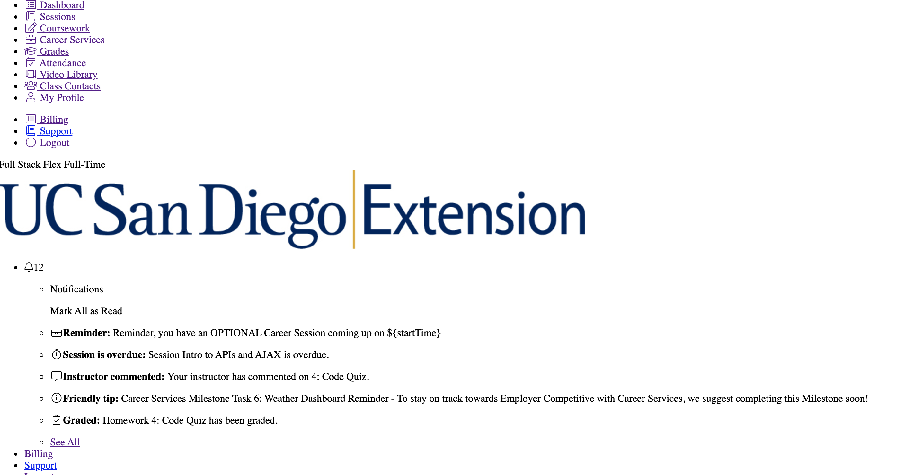

# work-day-scheduler
This tool functions as a digital day-planner. Utilizing jQuery and the moment library, this program tells you what hour of the day you are currently on and what you have upcoming later in the day.

The top of the screen will tell you the current date. The grey boxes are the hours that have already gone by today, the red box is the current hour, and the green boxes are upcoming. As seen here: 

When you input an event into one of the time slots and hit the save button. It'll store the event into local storage to be there the next time you load the page.

